```mermaid
mindmap
  root((🚀 Pritam's Journey))
    🎯 Learning
      🤖 AI/ML
      🔗 Blockchain
      ☁️ Cloud Architecture
    🛠️ Building
      💻 SaaS Platform
      📱 Mobile Apps
      🎨 Design System
    🤝 Contributing
      🌟 Open Source
      📝 Tech Blogs
      🎤 Speaking
    🎯 Goals 2024
      📈 10k GitHub Stars
      🏆 Tech Awards
      🌍 Global Impact
```

#  Hey there! I'm **Pritam** 

<div align="center">
  
</div>

<div align="center">
  
</div>

<div align="center">
  
</div>

---

##  **About Me**

<div align="center">
  
</div>

<table align="center">
  <tr>
    <td align="center">
      
      <br><b>🌟 Creative Problem Solver</b>
      <br>Turning ideas into reality
    </td>
    <td align="center">
      
      <br><b>🚀 Innovation Enthusiast</b>
      <br>Always exploring new tech
    </td>
    <td align="center">
      
      <br><b>🎯 Goal Oriented</b>
      <br>Committed to excellence
    </td>
  </tr>
</table>

```javascript
const pritam = {
    name: "Pritam 🔥",
    role: "Full Stack Wizard 🧙‍♂️",
    location: "🌍 Digital Nomad",
    passions: ["💻 Coding", "🎨 Design", "🚀 Innovation"],
    currentMission: "Building the next generation web experiences 🌟",
    superPower: "Transforming coffee ☕ into clean code ✨",
    
    techStack: {
        frontend: ["React ⚛️", "Vue 🟢", "TypeScript 🔷", "Next.js ⚡"],
        backend: ["Node.js 💚", "Python 🐍", "PostgreSQL 🐘", "MongoDB 🍃"],
        design: ["Figma 🎨", "Adobe XD 💜", "Blender 🟠"],
        devOps: ["Docker 🐳", "AWS ☁️", "Kubernetes ⚙️"],
        mobile: ["React Native 📱", "Flutter 💙"]
    },
    
    currentlyLearning: "AI & Machine Learning 🤖",
    funFact: "I code better when listening to synthwave music! 🎵",
    coffeeConsumed: "∞ cups and counting... ☕",
    
    lifePhilosophy: "Code with passion, design with purpose, debug with patience! 💫"
};
```

---

##  **Tech Arsenal**

<div align="center">

###  **Languages & Frameworks**

<p>
  
</p>

###  **Databases & Tools**

<p>
  
</p>

###  **Design & Creative**

<p>
  
</p>

</div>

<div align="center">
  
</div>

---

##  **GitHub Analytics**

<div align="center">
  
  
  

</div>

<div align="center">
  
</div>

<div align="center">
  
</div>
<div align="center">   </div> <div align="center">  </div> <div align="center">  </div>
---

##  **Achievement Showcase**

<div align="center">
  
</div>

<div align="center">
  
  
  
</div>

---

##  **Featured Projects**

<div align="center">
  
  <table>
    <tr>
      <td width="50%">
        <h3 align="center" color="white">🚀 Project Alpha</h3>
        <div align="center">  
          <a href="https://github.com/yourusername/project1" target="_blank">
            
          </a>
          <br>
          <br>
          <p>
            <a href="https://github.com/yourusername/project1" target="_blank">
              
            </a>
            <a href="https://yourproject1.com" target="_blank">
              
            </a>
          </p>
          <p><strong>React, Node.js, MongoDB</strong> - A revolutionary web application that changes everything!</p>
        </div>
      </td>
      <td width="50%">
        <h3 align="center">🎨 Project Beta</h3>
        <div align="center">  
          <a href="https://github.com/yourusername/project2" target="_blank">
            
          </a>
          <br>
          <br>
          <p>
            <a href="https://github.com/yourusername/project2" target="_blank">
              
            </a>
            <a href="https://yourproject2.com" target="_blank">
              
            </a>
          </p>
          <p><strong>Vue.js, TypeScript, Firebase</strong> - Beautiful UI meets powerful functionality!</p>
        </div>
      </td>
    </tr>
  </table>
  
</div>

---

##  **Current Focus**

<div align="center">



</div>

<div align="center">
  
</div>

---

##  **Weekly Development Stats**

<div align="center">
  
<!--START_SECTION:waka-->
```text
🌟 Languages I Code In

JavaScript   █████████████████████▓░   89.2% 
TypeScript   ██████▓░░░░░░░░░░░░░░░░   28.1%
CSS          ████▓░░░░░░░░░░░░░░░░░░   18.3%
Python       ███▓░░░░░░░░░░░░░░░░░░░   14.7%
HTML         ██▓░░░░░░░░░░░░░░░░░░░░   9.8%

🔥 Editors I Use

VS Code      ████████████████████▓░   95.2%
WebStorm     ██▓░░░░░░░░░░░░░░░░░░░░   4.8%

💻 Operating Systems

macOS        ████████████████████▓░   89.4%
Linux        ██▓░░░░░░░░░░░░░░░░░░░░   10.6%
```
<!--END_SECTION:waka-->

</div>

---

##  **Connect With Me**

<div align="center">

###  **Let's Build Something Amazing Together!**

<p>
  <a href="https://www.linkedin.com/in/yourprofile">
    
  </a>
  <a href="https://twitter.com/yourusername">
    
  </a>
  <a href="https://instagram.com/yourusername">
    
  </a>
  <a href="https://discord.gg/yourinvite">
    
  </a>
  <a href="https://youtube.com/c/yourchannel">
    
  </a>
</p>

<p>
  <a href="https://yourportfolio.com">
    
  </a>
  <a href="mailto:codewithpritam@gmail.com">
    
  </a>
  <a href="https://calendly.com/yourname">
    
  </a>
</p>

###  **Quick Contact**

<table align="center">
  <tr>
    <td align="center">
      
      <br><b>💼 Open for Work</b>
      <br>Freelance & Full-time
    </td>
    <td align="center">
      
      <br><b>🤝 Collaboration</b>
      <br>Open Source Projects
    </td>
    <td align="center">
      
      <br><b>💬 Mentoring</b>
      <br>Junior Developers
    </td>
  </tr>
</table>

</div>

---

##  **Fun Zone**

<div align="center">

###  **Random Dev Quote**


###  **Dev Meme of the Day**


###  **Snake Game - My Contributions**


</div>

---

<div align="center">
  
  
  
  
  
  
  <h3>🌟 "Code is poetry written in logic, design is poetry written in pixels!" 🌟</h3>
  
  
  
  **✨ Keep coding, keep creating, keep inspiring! ✨**
</div>
